<div align="center">

# 🌊 AQUA-AI

## AI-Powered Water Quality Monitoring Platform for India

### 🤖 Real-time Environmental Intelligence | 🏛️ Government Data Integration | 📊 Predictive Analytics

---

</div>

<div align="center">
  
  [](https://github.com/Kuldeep2822k/aqua-ai/stargazers)
  [](https://github.com/Kuldeep2822k/aqua-ai/network)
  [](https://github.com/Kuldeep2822k/aqua-ai/issues)
  [](https://choosealicense.com/licenses/mit/)
  
  
  
  
  
  
  
  
  
</div>

<div align="center">
  <h3>🚀 AI-Powered Water Quality Monitoring Platform for India</h3>
  <p><strong>Real-time insights • Government data integration • Predictive analytics • Public health protection</strong></p>
</div>

---

## 🌟 **Project Highlights**

<table>
<tr>
<td width="50%">

### 🎯 **What Makes This Special**

- 🤖 **AI-Powered Predictions** - Machine learning models forecast pollution events
- 🗺️ **Interactive Visualization** - Real-time India water quality map
- 🏛️ **Government Data Integration** - Official CPCB and Ministry data sources
- 📱 **Full-Stack Solution** - React frontend + Node.js backend + Python ML
- 🌐 **Public Impact** - Serves 1.4 billion people's water safety needs

</td>
<td width="50%">

### 💡 **Key Features**

- ✅ **Real-time monitoring** across Indian water bodies
- ✅ **Risk level assessment** with color-coded alerts
- ✅ **Historical trend analysis** and pattern recognition
- ✅ **Pollution event forecasting** using AI models
- ✅ **Public health alerts** and safety recommendations
- ✅ **Mobile-responsive** design for universal access

</td>
</tr>
</table>

## 📊 **Data Sources & Integration**

<div align="center">
  
  
  
</div>

### 🏛️ **Official Government Data Sources**

<table>
<tr>
<td width="25%" align="center">
  <br>
  🏢 **National Water Quality Database**<br>
  🌊 River Water Quality Monitoring<br>
  🔗 <a href="https://jal.gov.in/">jal.gov.in</a>
</td>
<td width="25%" align="center">
  <br>
  🏦 **Water Quality Monitoring Network**<br>
  🏭 Industrial Pollution Data<br>
  🔗 <a href="https://cpcb.nic.in/">cpcb.nic.in</a>
</td>
<td width="25%" align="center">
  <br>
  📊 **Various Water Quality Datasets**<br>
  🌐 Open Government Platform<br>
  🔗 <a href="https://data.gov.in/">data.gov.in</a>
</td>
<td width="25%" align="center">
  <br>
  💧 **Groundwater Quality Data**<br>
  🌊 Surface Water Monitoring<br>
  🔗 Research Institute
</td>
</tr>
</table>

### 🧪 **Water Quality Parameters Monitored**

<div align="center">

| Parameter               | 📊 Indicator                    | 🎯 Purpose             | ⚠️ Risk Level |
| ----------------------- | ------------------------------- | ---------------------- | ------------- |
| **BOD**                 | Biochemical Oxygen Demand       | 🌿 Organic pollution   | High          |
| **TDS**                 | Total Dissolved Solids          | 💧 Water purity        | Medium        |
| **Heavy Metals**        | Lead, Mercury, Cadmium, Arsenic | ☠️ Toxic contamination | Critical      |
| **pH Level**            | Acidity/Alkalinity              | ⚖️ Chemical balance    | Medium        |
| **Dissolved Oxygen**    | Aquatic life indicator          | 🐟 Ecosystem health    | High          |
| **Coliform**            | Bacterial contamination         | 🦀 Biological safety   | Critical      |
| **Nitrates/Phosphates** | Agricultural runoff             | 🌾 Nutrient pollution  | Medium        |

</div>

## 🚀 **Technology Stack**

<div align="center">
  <h3>🎨 Modern Tech Stack Powering Water Intelligence</h3>
</div>

### 🌐 **Frontend Excellence**

<p align="center">
  
</p>
<div align="center">
  
  📱 **React 18** + **TypeScript** for type-safe, responsive UI<br>
  🗺️ **Leaflet** for interactive geographical visualization<br>
  ⚡ **Vite** for fast local development and builds<br>
  🎨 **Modern CSS3** + **Responsive Design** for universal access
  
</div>

### ⚙️ **Backend Powerhouse**

<p align="center">
  
</p>
<div align="center">
  
  🚀 **Node.js** + **Express.js** for scalable API architecture<br>
  🐍 **Python** for ML training and data ingestion scripts<br>
  🔒 **JWT Authentication** + **Bcrypt** password hashing<br>
  ✅ **Input Validation** + **CORS** + **Rate Limiting** security<br>
  📝 **Winston Logger** for structured logging
  
</div>

### 🗄️ **Database & Storage**

<p align="center">
  
</p>
<div align="center">
  
  🗺️ **PostgreSQL** + **PostGIS** for spatial data operations<br>
  ⚡ **Redis** for caching and session management<br>
  📋 **SQLite** for development and testing environments
  
</div>

### 🤖 **AI/ML Pipeline**

<p align="center">
  
  
  
</p>
<div align="center">
  
  🤖 **TensorFlow** + **Scikit-Learn** for predictive modeling<br>
  📊 **Pandas** + **NumPy** for data processing and analysis<br>
  🎨 **Matplotlib** + **Plotly** for data visualization
  
</div>

### 🐳 **DevOps & Deployment**

<p align="center">
  
</p>
<div align="center">
  
  🐳 **Docker** containerization for consistent deployments<br>
  🌐 **AWS/Cloud** hosting with auto-scaling capabilities<br>
  🔄 **CI/CD Pipeline** with automated testing and deployment
  
</div>

## 📁 **Project Architecture**

<div align="center">
  
  
  
</div>

```
🌊 aqua-ai-project/
┊
├── 🌐 frontend/              # React + TypeScript Application
│   ├── 🎨 src/components/    # Reusable UI components
│   ├── 🗺️ src/pages/        # Route-based page components
│   ├── 🔧 src/hooks/        # Custom React hooks
│   ├── 📊 src/contexts/     # State management contexts
│   └── 🌍 public/          # Static assets and PWA config
┊
├── ⚙️ backend/               # Node.js + Express API Server
│   ├── 🛣️ src/routes/       # API endpoint definitions
│   ├── 💾 src/models/       # Database models
│   ├── 🔒 src/middleware/   # Auth, validation, error handling
│   ├── 🗄️ src/db/          # Database connection and queries
│   └── 🧰 src/utils/        # Logger and utilities
┊
├── 🤖 ai-models/             # Python ML/AI Pipeline
│   ├── 📊 models/          # Trained ML models (.pkl files)
│   ├── 🔬 training/        # Model training scripts
│   ├── 🔍 evaluation/      # Model performance metrics
│   └── 📝 preprocessing/   # Data cleaning and feature engineering
┊
├── 📦 data-pipeline/         # Government Data Integration
│   ├── 📊 collectors/      # API data fetching modules
│   ├── 🧹 cleaners/         # Data validation and cleaning
│   ├── 🔄 schedulers/       # Automated data sync jobs
│   └── 📊 transformers/    # Data format standardization
┊
├── 🗄️ database/             # Database Schema & Migrations
│   ├── 🏗️ migrations/       # Database version control
│   ├── 🌱 seeds/            # Sample data for development
│   └── 📄 schema.sql        # PostgreSQL + PostGIS schema
┊
├── 🐳 docker-compose.yml    # Multi-container orchestration
├── 📚 docs/                 # Comprehensive documentation
├── 🛠️ .github/workflows/    # CI/CD automation
└── 📝 README.md             # This beautiful documentation!
```
## 📁 **Project Architecture**

<div align="center">
  
  
  
</div>

````

---

## 🧩 **Architecture Diagrams**

Full diagram set is also available in [ARCHITECTURE_DIAGRAMS.md](docs/ARCHITECTURE_DIAGRAMS.md).

### System Architecture


### Data Flow Architecture


### Security Architecture


### Deployment Architecture

```mermaid
flowchart TB
  subgraph Dev[Developer Workstations]
    D1[Frontend]
    D2[Backend]
    D3[Data Pipeline]
  end

  subgraph CI[CI/CD]
    C1[GitHub Actions]
    C2[Build + Test]
    C3[Deploy]
  end

  subgraph Hosting[Hosting]
    H1[Render Frontend]
    H2[Render Backend]
  end

  subgraph DataInfra[Data Infrastructure]
    I1[Supabase Postgres + PostGIS]
    I2[Scheduled Pipeline]
  end

  D1 --> C1
  D2 --> C1
  D3 --> C1
  C1 --> C2 --> C3
  C3 --> H1
  C3 --> H2
  H2 --> I1
  I2 --> I1
```



### CI/CD Pipeline


### Database ER Diagram


### Runtime Sequence Diagram


### Data Governance Architecture


### Security Depth Architecture


### Operational Resilience Architecture


### User Journey Diagram


### Threat Model Diagram


## 🚀 **Quick Start Guide**

<div align="center">
  
  
  
</div>

### ⚡ **Lightning Fast Setup**

<table>
<tr>
<td width="50%">

#### 1️⃣ **Clone & Navigate**
```bash
git clone https://github.com/Kuldeep2822k/aqua-ai.git
cd aqua-ai
````

#### 2️⃣ **Install Dependencies**

```bash
# Install root dependencies (also installs backend via postinstall)
npm install

# Install frontend dependencies
cd frontend && npm install && cd ..

# Optional: install Python dependencies for AI + data pipeline
pip install -r requirements.txt
pip install -r data-pipeline/requirements.txt
```

#### 2.5️⃣ **Configure Environment**

```bash
# Copy environment template
cp .env.example .env.development

# Edit .env.development with your settings:
# - Database connection (PostgreSQL)
# - JWT secret key
# - API keys (optional)
```

#### 2.6️⃣ **Setup Database**

```bash
# Run database migrations
npm run db:migrate

# (Optional) Seed sample data
npm run db:seed
```

</td>
<td width="50%">

#### 3️⃣ **Launch Application**

```bash
# Terminal 1: start backend API
cd backend && npm run dev

# Terminal 2: start frontend
cd frontend && npm run dev
```

#### 4️⃣ **Access Your Dashboard**

- 🌐 **Frontend**: http://localhost:5173
- ⚙️ **Backend API**: http://localhost:5000
- 📊 **Interactive Map**: Ready to explore!

</td>
</tr>
</table>

### 🐳 **Docker One-Click Deploy**

<div align="center">
  
</div>

```bash
# Complete stack deployment with Docker
docker-compose up -d

# 🎉 That's it! Your Aqua-AI platform is live!
```

### 📚 **Documentation Links**

<div align="center">
  
  [](SETUP.md)
  [](docs/SYSTEM_VALIDATION_REPORT.md)
  [](deploy.md)
  
</div>

---

## 🎯 **Live Demo & Features**

<div align="center">
  <h3>🌐 Experience India's Water Quality Intelligence</h3>
  
  
</div>

### 🗺️ **Interactive Map Dashboard**

<div align="center">
  
  
  
</div>

<table>
<tr>
<td width="25%" align="center">
  <br><br>
  • Pan & zoom across India<br>
  • Click markers for detailed data<br>
  • Filter by parameters & risk levels<br>
  • Color-coded safety assessment
</td>
<td width="25%" align="center">
  <br><br>
  • Live WQI scores<br>
  • Safety threshold indicators<br>
  • Historical trend analysis<br>
  • Government data attribution
</td>
<td width="25%" align="center">
  <br><br>
  • ML-powered forecasting<br>
  • Pollution event prediction<br>
  • Confidence score metrics<br>
  • Hotspot identification
</td>
<td width="25%" align="center">
  <br><br>
  • Threshold violation detection<br>
  • Risk escalation notifications<br>
  • Public health advisories<br>
  • Email/SMS capabilities
</td>
</tr>
</table>

### 🌈 **Risk Level Color Coding**

<div align="center">
  
  
  
  
</div>

---

## 🏗️ **System Architecture**

<div align="center">
  
  
  
</div>


<div align="center">

### 🐍 **Detailed Architecture Flow**

| Layer           | Technology           | Purpose           | Scalability      |
| --------------- | -------------------- | ----------------- | ---------------- |
| 🌐 **Frontend** | React + TypeScript   | Interactive UI/UX | CDN Distribution |
| ⚙️ **Backend**  | Node.js + Express    | API Services      | Load Balancing   |
| 🗄️ **Database** | PostgreSQL + PostGIS | Spatial Data      | Read Replicas    |
| 🤖 **AI/ML**    | Python + TensorFlow  | Predictions       | Model Serving    |
| 📊 **Cache**    | Redis                | Performance       | Clustering       |

</div>

---

## 🏆 **Hackathon Impact & Innovation**

<div align="center">
  <h3>🌍 Addressing India's Most Critical Environmental Challenge</h3>
</div>

<table>
<tr>
<td width="50%">

### 📊 **Problem Scope**

- 🌊 **600M+ People** affected by water pollution
- 🏥 **70% of Surface Water** contaminated
- 💰 **₹3 Trillion** economic impact annually
- ⚠️ **2M Deaths/year** from water-related diseases

</td>
<td width="50%">

### 🚀 **Our Solution Impact**

- 🤖 **AI-Powered** early warning system
- 🏛️ **Government Data** integration
- 📊 **Real-time** public access to water data
- 📈 **Predictive Analytics** for policy makers

</td>
</tr>
</table>

### 🎆 **Innovation Highlights**

<div align="center">
  
  
  
  
  
</div>

---

## 💰 **Business Model & Monetization**

<div align="center">
  <h3>💹 Revenue Potential: $9.5M+ by Year 3</h3>
  
  [](REVENUE_STRATEGY.md)
  
</div>

<table>
<tr>
<td width="33%" align="center">
  <br><br>
  🏛️ **State & Municipal**<br>
  $200K - $500K per contract<br>
  28 states + major cities
</td>
<td width="33%" align="center">
  <br><br>
  🏭 **Industrial Compliance**<br>
  $5K - $50K monthly<br>
  1000+ facilities target
</td>
<td width="33%" align="center">
  <br><br>
  📊 **Data Access**<br>
  $99 - $2,499 monthly<br>
  Developers & researchers
</td>
</tr>
</table>

---

## 🤝 **Contributing & Community**

<div align="center">
  
  [](https://github.com/Kuldeep2822k/aqua-ai/issues)
  [](https://discord.gg/aqua-ai)
  [](https://twitter.com/AquaAI_India)
  
</div>

### 👩‍💻 **How to Contribute**

1. 🍴 **Fork** the repository
2. 🌱 **Create** your feature branch (`git checkout -b feature/AmazingFeature`)
3. ✨ **Commit** your changes (`git commit -m 'Add some AmazingFeature'`)
4. 🚀 **Push** to the branch (`git push origin feature/AmazingFeature`)
5. 🎉 **Open** a Pull Request

---

<div align="center">
  <h2>🎆 Built with ❤️ for India's Water Security</h2>
  
  
  
  
  
  ### ⭐ **Star this repo if it helped you!**
  
  [](https://github.com/Kuldeep2822k/aqua-ai/stargazers)
  [](https://github.com/Kuldeep2822k/aqua-ai/network)
  [](https://github.com/Kuldeep2822k/aqua-ai/watchers)
  
  ---
  
  <p><strong>Kuldeep Kumar • 2024 • MIT Licensed</strong></p>
  
</div>
