# 🏗️ AQUA-AI Architecture Diagrams

Complete visual documentation of system architecture, security, deployment, and operational flows.

---

## 🌐 System Architecture

High-level overview of the complete system architecture showing all major components and their interactions.

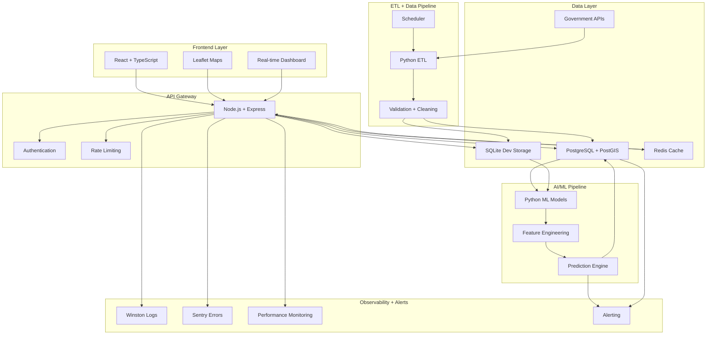

---

## 📊 Data Flow Architecture

End-to-end data flow from government sources through ETL pipelines to user-facing delivery.

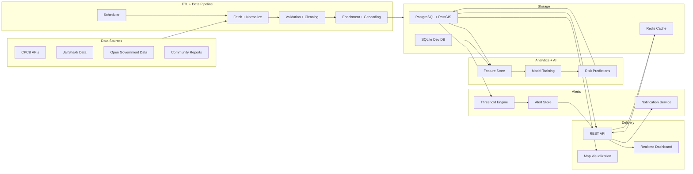

---

## 🔒 Security Architecture

Multi-layered security controls from edge protection to data security.

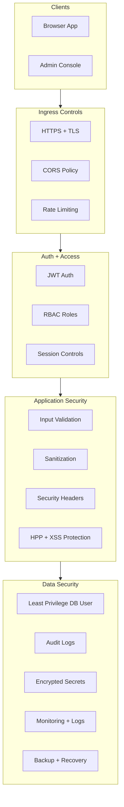

---

## 🚀 Deployment Architecture

Development to production deployment pipeline and infrastructure.

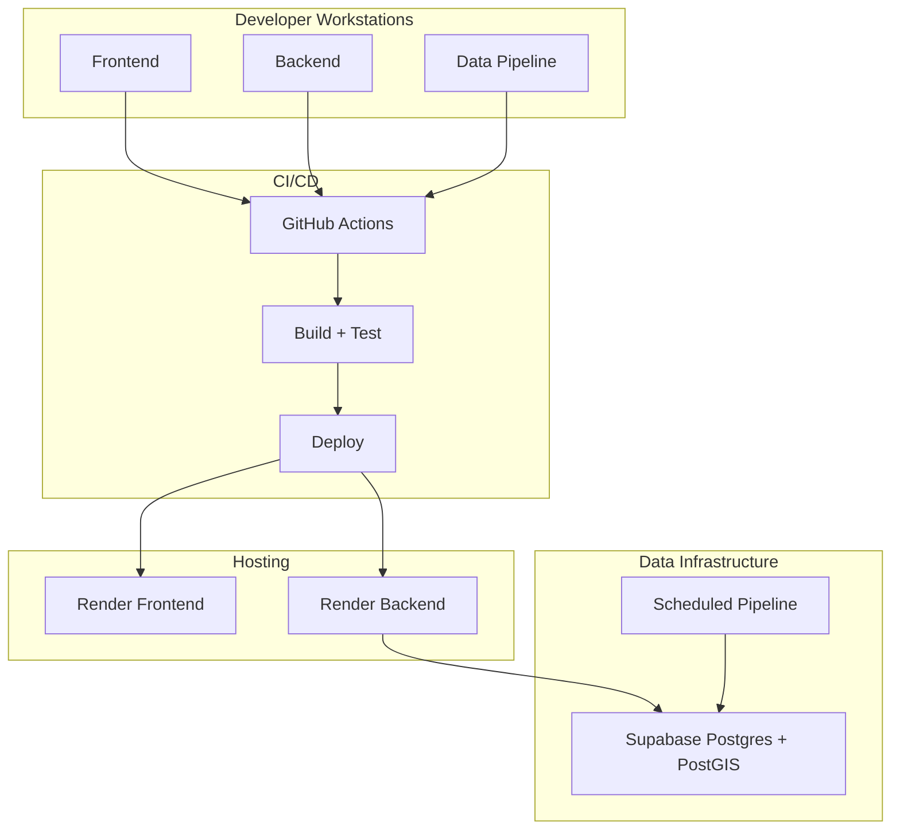

---

## ⚙️ CI/CD Pipeline

Automated continuous integration and deployment workflow.

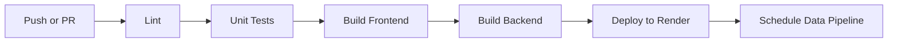

---

## 🗄️ Database ER Diagram

Database schema showing entity relationships and foreign key constraints.

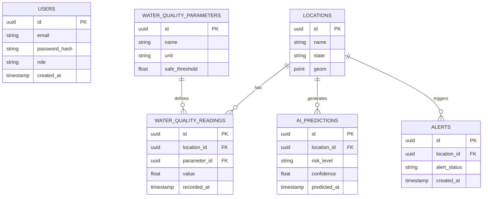

---

## 🔄 Runtime Sequence Diagram

Detailed request flow showing interactions between system components.

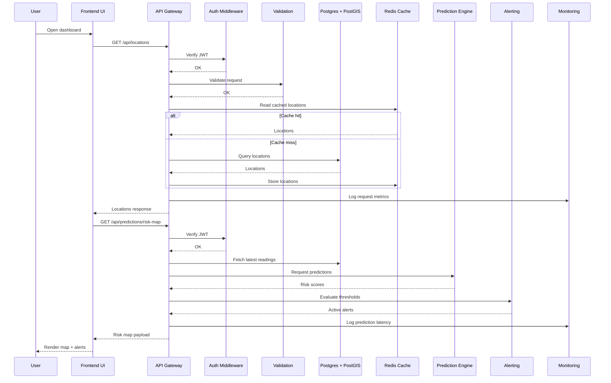

---

## 📋 Data Governance Architecture

Data quality, lineage tracking, and governance controls.

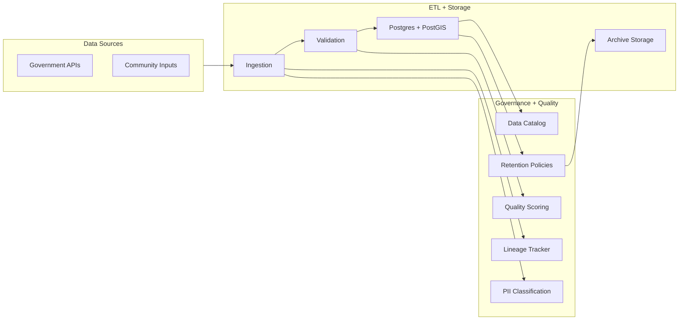

---

## 🛡️ Security Depth Architecture

Defense-in-depth security layers including edge protection and secrets management.

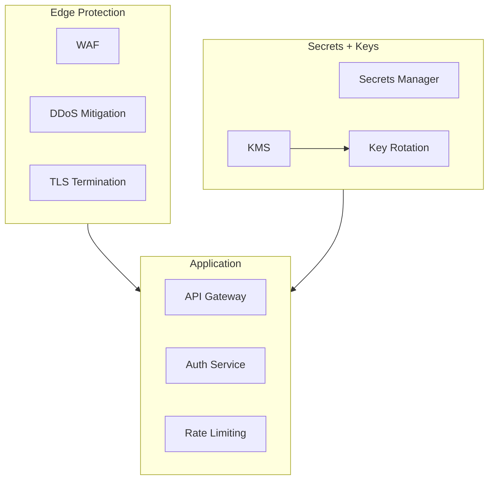

---

## 🔄 Operational Resilience Architecture

High availability setup with failover and disaster recovery capabilities.

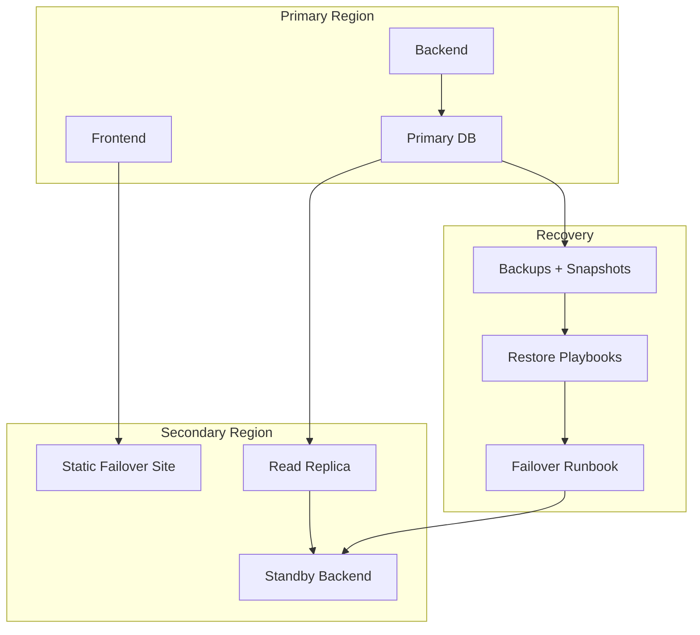

---

## 👤 User Journey Diagram

Typical user flow through the application from login to report generation.

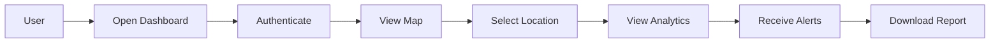

---

## ⚠️ Threat Model Diagram

Security threats, protective controls, and expected outcomes.

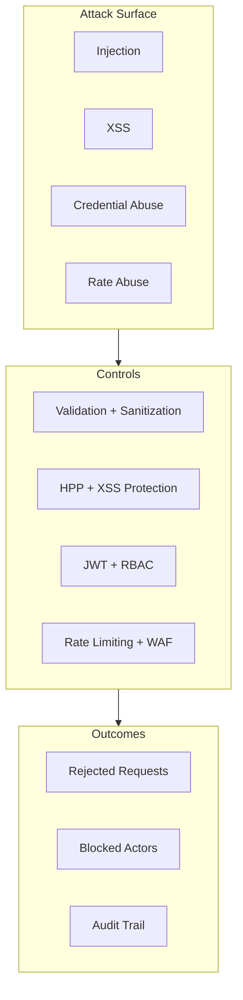

---

**Built with ❤️ for India's Water Security**

[Back to Main README](../README.md)

