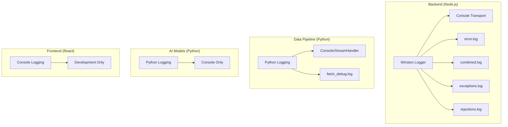
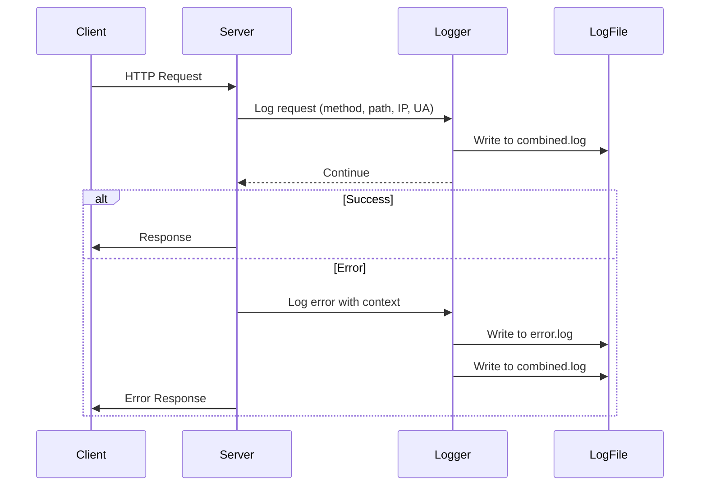
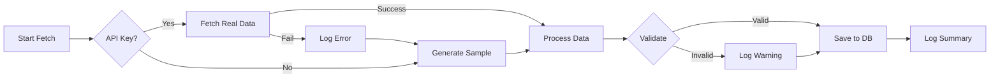
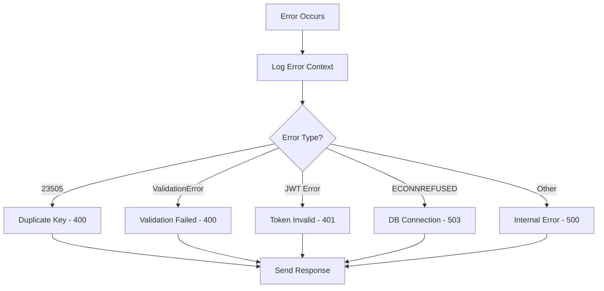

# Aqua-AI Logging Pipeline Documentation

This document provides a comprehensive overview of all logging mechanisms implemented across the Aqua-AI platform.

---

## Table of Contents

- [Architecture Overview](#architecture-overview)
- [Backend Logging (Node.js/Winston)](#backend-logging-nodejswinston)
- [Data Pipeline Logging (Python)](#data-pipeline-logging-python)
- [AI Models Logging (Python)](#ai-models-logging-python)
- [Frontend Logging](#frontend-logging)
- [Log Files and Outputs](#log-files-and-outputs)
- [Log Levels and Severity](#log-levels-and-severity)
- [Flow Diagrams](#flow-diagrams)

---

## Architecture Overview



---

## Backend Logging (Node.js/Winston)

### Core Logger Configuration

**File:** [`backend/src/utils/logger.js`](file:///c:/Users/kulde/aqua-ai/backend/src/utils/logger.js)

The backend uses [Winston](https://github.com/winstonjs/winston) for structured logging with multiple transports.

#### Configuration Details

| Property | Value | Description |
|----------|-------|-------------|
| Default Level | `info` | Controlled by `LOG_LEVEL` env var |
| Service Name | `aqua-ai-backend` | Attached to all log entries |
| Max File Size | 5MB | Per log file before rotation |
| Max Files | 5 | Log file rotation limit |

#### Log Format

```javascript
// JSON format for file transports
{
  timestamp: 'YYYY-MM-DD HH:mm:ss',
  level: 'info',
  message: 'Log message',
  service: 'aqua-ai-backend',
  ...metadata
}

// Console format (development)
// 2024-01-15 14:30:00 [info]: Log message {"key": "value"}
```

#### Transports

| Transport | Target | Level | Purpose |
|-----------|--------|-------|---------|
| Console | stdout | all | Real-time monitoring |
| File | `logs/error.log` | error | Error isolation |
| File | `logs/combined.log` | all | Complete audit trail |
| File | `logs/exceptions.log` | - | Uncaught exceptions |
| File | `logs/rejections.log` | - | Unhandled promise rejections |

---

### Request Logging Middleware

**File:** [`backend/src/server.js`](file:///c:/Users/kulde/aqua-ai/backend/src/server.js#L115-L122)

Every HTTP request is logged with metadata:

```javascript
logger.info(`${req.method} ${req.path}`, {
  ip: req.ip,
  userAgent: req.get('user-agent'),
});
```

#### Logged Request Data

- HTTP Method (GET, POST, PUT, DELETE)
- Request path
- Client IP address
- User-Agent header

---

### Error Handler Middleware

**File:** [`backend/src/middleware/errorHandler.js`](file:///c:/Users/kulde/aqua-ai/backend/src/middleware/errorHandler.js)

Structured error logging with context:

```javascript
logger.error('Error occurred:', {
  message: err.message,
  stack: err.stack,
  url: req.originalUrl,
  method: req.method,
  ip: req.ip,
  userId: req.user?.id,
});
```

#### Error Types Handled

| Error Code/Name | Mapped Error | Status |
|-----------------|--------------|--------|
| `23505` | Duplicate field value | 400 |
| `ValidationError` | Validation failed | 400 |
| `JsonWebTokenError` | Invalid token | 401 |
| `TokenExpiredError` | Token expired | 401 |
| `ECONNREFUSED` | Database connection failed | 503 |

---

### Component-Specific Logging

#### Database Connection

**File:** [`backend/src/db/connection.js`](file:///c:/Users/kulde/aqua-ai/backend/src/db/connection.js)

```javascript
// Success
logger.info('✅ Database connection established successfully');

// Failure
logger.error('❌ Database connection failed:', error.message);

// Shutdown
logger.info('Database connection closed');
```

#### Authentication Events

**File:** [`backend/src/routes/auth.js`](file:///c:/Users/kulde/aqua-ai/backend/src/routes/auth.js)

```javascript
// Registration
logger.info(`New user registered: ${email}`);

// Login
logger.info(`User logged in: ${email}`);

// Auth failures (in middleware/auth.js)
logger.warn('Optional auth failed:', error.message);
```

#### Alert Actions

**File:** [`backend/src/routes/alerts.js`](file:///c:/Users/kulde/aqua-ai/backend/src/routes/alerts.js)

```javascript
// Alert resolved
logger.info(`Alert ${id} resolved by user ${req.user.id}`);

// Alert dismissed
logger.info(`Alert ${id} dismissed by user ${req.user.id}`);
```

#### Server Lifecycle

```javascript
// Startup
logger.info(`🚀 Aqua-AI Backend server is running on port ${PORT}`);
logger.info(`📊 Environment: ${process.env.NODE_ENV || 'development'}`);
logger.info(`🔗 Health check: http://localhost:${PORT}/api/health`);

// Warnings
logger.warn('⚠️  Starting server without database connection');
logger.warn(`CORS blocked origin: ${origin}`);
logger.warn(`Request timeout: ${req.method} ${req.url}`);

// Shutdown
logger.info('SIGTERM signal received: closing HTTP server');
logger.info('HTTP server closed');
```

---

## Data Pipeline Logging (Python)

**File:** [`data-pipeline/fetch_data.py`](file:///c:/Users/kulde/aqua-ai/data-pipeline/fetch_data.py)

### Configuration

```python
logging.basicConfig(
    level=logging.INFO,
    format='%(asctime)s - %(name)s - %(levelname)s - %(message)s',
    handlers=[
        logging.FileHandler("data-pipeline/fetch_debug.log", encoding='utf-8'),
        logging.StreamHandler()
    ]
)
logger = logging.getLogger(__name__)
```

### Log Output Destinations

| Handler | Target | Purpose |
|---------|--------|---------|
| FileHandler | `data-pipeline/fetch_debug.log` | Persistent debug log |
| StreamHandler | stdout | Console output |

### Key Logged Events

| Event | Level | Example |
|-------|-------|---------|
| Database connection | INFO | `Connected to PostgreSQL database` |
| Connection fallback | WARNING | `Falling back to SQLite due to connection failure` |
| Data fetch start | INFO | `Fetching data from data.gov.in` |
| API key missing | WARNING | `No API key for data.gov.in, using sample data` |
| API request failure | ERROR | `API request failed: {status}` |
| Data processing | INFO | `Processing data from data.gov.in` |
| Validation failure | WARNING | `Invalid {param} value: {value}` |
| Location upsert | INFO | `Upserting {count} unique locations found in data` |
| Save completion | INFO | `Saved {count} records to PostgreSQL` |
| Fetch summary | INFO | `Fetched {count} water quality records` |

---

## AI Models Logging (Python)

**File:** [`ai-models/train_model.py`](file:///c:/Users/kulde/aqua-ai/ai-models/train_model.py)

### Configuration

```python
logging.basicConfig(level=logging.INFO)
logger = logging.getLogger(__name__)
```

> [!NOTE]
> AI models use console-only logging without file persistence.

### Key Logged Events

| Event | Level | Example |
|-------|-------|---------|
| Data loading | INFO | `Loaded {count} records from database` |
| Sample generation | INFO | `Generating sample water quality data for model training` |
| Preprocessing | INFO | `Preprocessing data for ML training` |
| Model training | INFO | `Training machine learning models` |
| Per-target training | INFO | `Training model for {target}` |
| Insufficient data | WARNING | `Skipping {target}: insufficient data ({count} samples)` |
| Model evaluation | INFO | `{target}: {model_type} model, R² = {score}` |
| Prediction error | ERROR | `Error predicting {parameter}: {error}` |
| Model save | INFO | `Saving models to disk` / `Models saved to {path}` |

---

## Frontend Logging

### Production Considerations

> [!IMPORTANT]
> Console logging is minimized in production builds. Most `console.log` statements are commented out or removed.

### Active Logging Locations

| Component | Purpose |
|-----------|---------|
| `useServiceWorker.ts` | Service worker registration status |
| `PWAContext.tsx` | Install prompt user responses |
| `useRoutePreloader.ts` | Route preloading confirmations |
| `NotificationContext.tsx` | WebSocket connection status |

### Example Frontend Logs

```typescript
// Service Worker
console.log('Content is cached for offline use.');

// PWA Install
console.log('User accepted the install prompt');
console.log('User dismissed the install prompt');

// Route Preloading
console.log(`✅ Preloaded route: ${path}`);

// WebSocket
console.log('WebSocket connected');
```

---

## Log Files and Outputs

### Backend Log Files

```
backend/logs/
├── combined.log    # All log levels
├── error.log       # Error level only
├── exceptions.log  # Uncaught exceptions
└── rejections.log  # Unhandled promise rejections
```

### Data Pipeline Log Files

```
data-pipeline/
└── fetch_debug.log  # Data fetching debug log
```

### Log Rotation Policy

| Setting | Value |
|---------|-------|
| Max file size | 5MB |
| Max files kept | 5 |
| Rotation trigger | Size-based |

---

## Log Levels and Severity

### Winston (Backend)

| Level | Priority | Usage |
|-------|----------|-------|
| `error` | 0 | Errors requiring immediate attention |
| `warn` | 1 | Warnings, degraded functionality |
| `info` | 2 | General operational messages |
| `http` | 3 | HTTP request logging |
| `verbose` | 4 | Detailed information |
| `debug` | 5 | Debug information |
| `silly` | 6 | Trace-level detail |

### Python (Data Pipeline / AI Models)

| Level | Value | Usage |
|-------|-------|-------|
| `CRITICAL` | 50 | System failure |
| `ERROR` | 40 | Error events |
| `WARNING` | 30 | Warning messages |
| `INFO` | 20 | Informational messages |
| `DEBUG` | 10 | Debug information |

---

## Flow Diagrams

### Request Logging Flow



### Data Pipeline Logging Flow



### Error Handling Flow



---

## Environment Variables

| Variable | Default | Description |
|----------|---------|-------------|
| `LOG_LEVEL` | `info` | Minimum log level to capture |
| `NODE_ENV` | `development` | Affects console format styling |

---

## Best Practices Implemented

✅ **Structured Logging** - JSON format for machine parsing  
✅ **Log Rotation** - Size-based rotation prevents disk overflow  
✅ **Exception Handling** - Dedicated files for uncaught exceptions  
✅ **Request Tracing** - IP and User-Agent captured  
✅ **User Context** - User ID logged for authenticated actions  
✅ **Error Categorization** - Different error types handled appropriately  
✅ **Graceful Shutdown** - Shutdown events logged for debugging  
✅ **No Sensitive Data** - Passwords never logged, only emails for context  

---

*Last Updated: January 2025*
